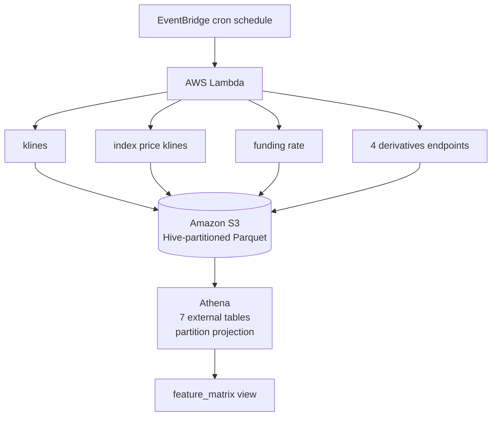

# 📊 Binance Futures Data Pipeline

An end-to-end data pipeline that collects **klines, funding rate, and derivatives** data from the Binance USDⓈ-M Futures API, stores it as Hive-partitioned Parquet in S3, and exposes it through an Athena serving layer — culminating in a single **feature matrix** designed for time-series analysis and ML model development.

---

## Overview

An AWS Lambda function runs on a scheduled trigger (EventBridge) and collects **7 datasets per symbol** from the Binance Futures API. Raw data lands in S3 as per-endpoint Parquet files, which are queried through Athena external tables and joined into a single hourly feature matrix view.

The pipeline has three layers:

1. **Ingestion** — EventBridge-triggered Lambda pulls from the Binance API.  
2. **Storage** — Hive-partitioned Parquet in S3, with incremental watermark-driven loading.  
3. **Serving** — Athena external tables (partition projection) and a One Big Table feature-matrix view.

Incremental loading is driven by a **per-symbol, per-endpoint watermark** stored as a small JSON file in S3. On the first run, each endpoint backfills its full available history; on every subsequent run, fetching resumes from the last recorded `startTime`, and new rows are upserted — deduplicating by the endpoint's time field so no rows are ever duplicated.

**Collected datasets per symbol:**

| Dataset | Binance Endpoint | Time Field | First-Run Backfill |
| :---- | :---- | :---- | :---- |
| Klines (OHLCV) | `/fapi/v1/klines` | `open_time` | From 2019-09-05 (futures launch) |
| Index Price Klines | `/fapi/v1/indexPriceKlines` | `open_time` | From 2019-09-05 (futures launch) |
| Funding Rate | `/fapi/v1/fundingRate` | `fundingTime` | From 2019-09-05 (futures launch) |
| Open Interest | `/futures/data/openInterestHist` | `timestamp` | Up to 500 rows (API limit) |
| Global Long/Short Account Ratio | `/futures/data/globalLongShortAccountRatio` | `timestamp` | Up to 500 rows (API limit) |
| Top Trader Account Ratio | `/futures/data/topLongShortAccountRatio` | `timestamp` | Up to 500 rows (API limit) |
| Top Trader Position Ratio | `/futures/data/topLongShortPositionRatio` | `timestamp` | Up to 500 rows (API limit) |

**Note on backfill limits:** Binance's `/futures/data/*` endpoints only expose the most recent \~30 days of history, so derivatives first-runs are capped at 500 rows by the API. Klines, index price klines, and funding rate have no such limit and are paginated all the way back to the futures launch.

**Note on derived features:** the taker buy/sell ratio is *not* collected as a separate endpoint — it is derived at query time from the klines `taker_buy_base` and `volume` columns, avoiding a redundant dataset.

---

## Architecture

**Per endpoint, per symbol, each run:**

1. Read the watermark JSON (`last_startTime`). Missing file → treated as first run.  
2. **First run:** klines / index price / funding rate paginate from 2019-09-05; derivatives fetch up to 500 rows.  
3. **Incremental run:** fetch from `last_startTime + 1`.  
4. Clean (deduplicate on time field, coerce to numeric, write with `index=False`).  
5. Upsert into the endpoint's Parquet file (concat → drop duplicates → sort).  
6. Write the new watermark.

One file is written **per endpoint per symbol**. The datasets are joined into a single wide table only at the serving layer (see below), not at ingestion.

---

## Environment Variables

Configure these in your Lambda function's environment settings:

| Variable | Required | Default | Description |
| :---- | :---- | :---- | :---- |
| `S3_BUCKET` | ✅ | — | S3 bucket name where Parquet and watermark files are stored |
| `SYMBOLS` | ✅ | — | Comma-separated list of trading pairs (e.g. `BTCUSDT,ETHUSDT`) |
| `PERIOD` | ❌ | `1h` | Aggregation period for klines & derivatives (`5m`, `15m`, `1h`, `4h`, `1d`) |

Incremental fetching is bounded by the watermark, not a fixed row count. Funding rate ignores `PERIOD` (it has fixed settlement times).

**Example:**

S3\_BUCKET \= my-trading-data-bucket

SYMBOLS   \= BTCUSDT,ETHUSDT,BNBUSDT,SOLUSDT,HYPEUSDT,XRPUSDT

PERIOD    \= 1h

---

## S3 Output

### Layout

    s3://{S3\_BUCKET}/binance-futures/

    ├── \_watermark/

    │     └── {SYMBOL}-{endpoint}-period={PERIOD}.json

    └── endpoint={endpoint}/

          └── symbol={SYMBOL}/
   
                └── {SYMBOL}-{endpoint}-period={PERIOD}.parquet

Hive-style partition keys (`endpoint=`, `symbol=`) allow Athena to use **partition projection** for efficient, low-scan queries.

### Watermark file

Each `_watermark/*.json` tracks incremental state for one symbol+endpoint:

    {
 
      "symbol": "BTCUSDT",

      "period": "1h",

      "endpoint": "openInterestHist",

      "last_startTime": 1718000000000,

      "update_time": 1718003600000,

      "update_time_UTC": "2024-06-10T08:00:00+00:00"

    }

### Parquet schemas (raw Binance columns)

Each endpoint is stored in its own file with the raw columns Binance returns.

**Klines** (`endpoint=klines`) — `ignore` column dropped:

    open_time · open · high · low · close · volume ·

    close_time · quote_volume · num_trades ·

    taker_buy_base · taker_buy_quote

**Index price klines** (`endpoint=indexPriceKlines`):

    open_time · open · high · low · close · close_time

**Funding rate** (`endpoint=fundingRate`):

    symbol · fundingTime · fundingRate · markPrice

**Open interest** (`endpoint=openInterestHist`):

    symbol · sumOpenInterest · sumOpenInterestValue · CMCCirculatingSupply · timestamp

**Global / Top-trader ratios** (`globalLongShortAccountRatio`, `topLongShortAccountRatio`, `topLongShortPositionRatio`):

    symbol · longAccount · shortAccount · longShortRatio · timestamp

For `topLongShortPositionRatio`, `longAccount` and `shortAccount` represent position share rather than account share.

All timestamp/time fields are Unix epoch **milliseconds (UTC)**.

---

## Serving Layer (Athena)

The raw per-endpoint Parquet files are exposed as a queryable serving layer in Athena, culminating in a single feature matrix for model training. SQL definitions live in `athena/`.

### External Tables

Seven external tables (one per endpoint) sit over the S3 data, each using **partition projection** on `symbol` — partitions are computed at query time with zero maintenance (no `MSCK REPAIR`, no manual `ADD PARTITION`). Table definitions are in `athena/tables/`.

Example (funding rate):

    CREATE EXTERNAL TABLE funding_rate (

        fundingtime BIGINT,

        fundingrate DOUBLE,
 
        markprice   DOUBLE

    )

    PARTITIONED BY (symbol STRING)

    STORED AS PARQUET

    LOCATION 's3://<your-bucket>/binance-futures/endpoint=fundingRate/'

    TBLPROPERTIES (

        'projection.enabled' = 'true',
    
        'projection.symbol.type'   = 'enum',

        'projection.symbol.values' = <your-symbol>

    );

### Feature Matrix View (One Big Table)

`athena/feature_matrix_view.sql` defines a denormalized **One Big Table (OBT)** — a single hourly feature matrix per `(symbol, timestamp)` built by joining all endpoints, designed as the training dataset for downstream ML.

Transformations handled in the view:

- **Timestamp alignment** — funding-rate timestamps drift 1–5 ms off the hour; all time fields are floored to the hour (`ts / 3600000 * 3600000`) so joins match cleanly.  
- **Funding-rate forward-fill** — funding settles every 8 h while other metrics are hourly. A `LAST_VALUE(...) IGNORE NULLS OVER (PARTITION BY symbol ORDER BY ts)` window carries the last known funding rate forward across the intervening hours. The frame is backward-looking only (`UNBOUNDED PRECEDING` to `CURRENT ROW`), so there is no look-ahead leakage.  
- **Derived features** — `basis_rate` computed as `(close − index_close) / index_close`; taker long/short ratio derived inline from klines as `taker_buy_base / (volume − taker_buy_base)`.  
- **Redundancy pruning** — base-vs-quote duplicate columns (`sumOpenInterestValue`, `quote_volume`) and near-static fields (`CMCCirculatingSupply`) are dropped in favour of a single representative per concept.

Because the derivatives endpoints are capped at \~30 days, the joined feature matrix uses INNER joins on those tables and clips to the window where all features coexist (\~500 rows per symbol at launch), growing continuously as the pipeline runs.

---

## IAM Permissions Required

The Lambda execution role needs read/write on the data prefix and list on the bucket:

    [
      {
        "Effect": "Allow",
        "Action": ["s3:GetObject", "s3:PutObject"],
        "Resource": "arn:aws:s3:::your-bucket-name/binance-futures/*"
      },
      {
        "Effect": "Allow",
        "Action": "s3:ListBucket",
        "Resource": "arn:aws:s3:::your-bucket-name"
      }
    ]

---

## Dependencies

    requests

    pandas

    pyarrow

    boto3

`boto3` is pre-installed in the Lambda runtime. Package `requests`, `pandas`, and `pyarrow` into a Lambda layer or your deployment ZIP (a container image also works and avoids the layer size limit).

---

## Deployment

### Lambda Settings

| Setting | Recommended |
| :---- | :---- |
| Runtime | Python 3.12 |
| Memory | 512 MB (higher for first-run backfills / many symbols) |
| Timeout | 5 – 15 min (first-run klines/funding backfills are long-running) |
| Architecture | any |

After the initial backfill, incremental runs are light — you can lower memory/timeout if desired.

### EventBridge Schedule

| Setting | Value | Reason |
| :---- | :---- | :---- |
| `PERIOD` | `1h` | 1-hour candles / derivatives aggregation |
| Run frequency | **Once daily** | \~24 new klines rows/day; watermark guarantees no gaps regardless of cadence |
| Derivatives history | \~30 days | Binance only exposes recent derivatives; run at least monthly to avoid gaps |

Because incremental fetching is watermark-driven (resume from `last_startTime`), the pipeline self-heals after missed runs for klines and funding rate — it simply fetches everything since the last success. **Derivatives are the exception:** Binance only serves \~30 days of history, so a gap longer than that window is unrecoverable. Running at least daily keeps everything complete while minimizing Lambda cost.

---

## Error Handling

- **Per-symbol isolation:** if one symbol fails (API error, bad data), the others continue processing. The exception is caught in `lambda_handler` and captured in the return summary.  
- **Missing watermark (first run):** `read_watermark` catches `NoSuchKey` → returns `None` → triggers a full backfill for that endpoint.  
- **API non-200 response:** the fetch function returns `None`; `fetch_process` logs it and returns `"FAILED — fetch error"` without crashing the run.  
- **No new data:** returns `"OK — no new data"` when the incremental fetch is empty.  
- **Return body** always includes a per-symbol, per-endpoint summary:

     {

      "summary": {

        "BTCUSDT": {

          "open_interest": {"new_rows": 24, "total_rows": 720,   "last_startTime": 1718000000000},

          "fundingrate":   {"new_rows": 3,  "total_rows": 12960, "last_startTime": 1718000000000},

          "klines":        {"new_rows": 24, "total_rows": 42000, "last_startTime": 1718000000000}

        }

      }

     }

---

## Project Structure

    binance-futures-data-collector/

    ├── src/

    │   └── binance-futures-data-collector.py   # collector logic + Lambda entry point (lambda_handler)

    ├── athena/

    │   ├── tables/                             # CREATE EXTERNAL TABLE per endpoint

    │   │   ├── klines.sql

    │   │   ├── index_price_klines.sql

    │   │   ├── funding_rate.sql

    │   │   ├── open_interest.sql

    │   │   ├── global_ls_account_ratio.sql

    │   │   ├── top_ls_account_ratio.sql

    │   │   └── top_ls_position_ratio.sql

    │   └── feature_matrix_view.sql             # One Big Table: joined hourly feature matrix

    ├── README.md

    ├── requirements.txt

    └── LICENSE

---

## Notes

- All timestamps are stored in **UTC** (Unix epoch milliseconds).  
- Each endpoint lands in its **own file**. The datasets are joined into a wide feature matrix by the Athena `feature_matrix` view at query time, not when the data is collected.  
- The upsert logic uses `keep="last"` deduplication, so re-running the function for an overlapping window is safe and idempotent.  
- Binance rate limits apply. Fetch loops `time.sleep(0.3)` between paginated pages; for large symbol lists consider batching across multiple Lambda invocations.  
- `PERIOD` affects klines and derivatives only; funding rate settles on Binance's fixed schedule.

