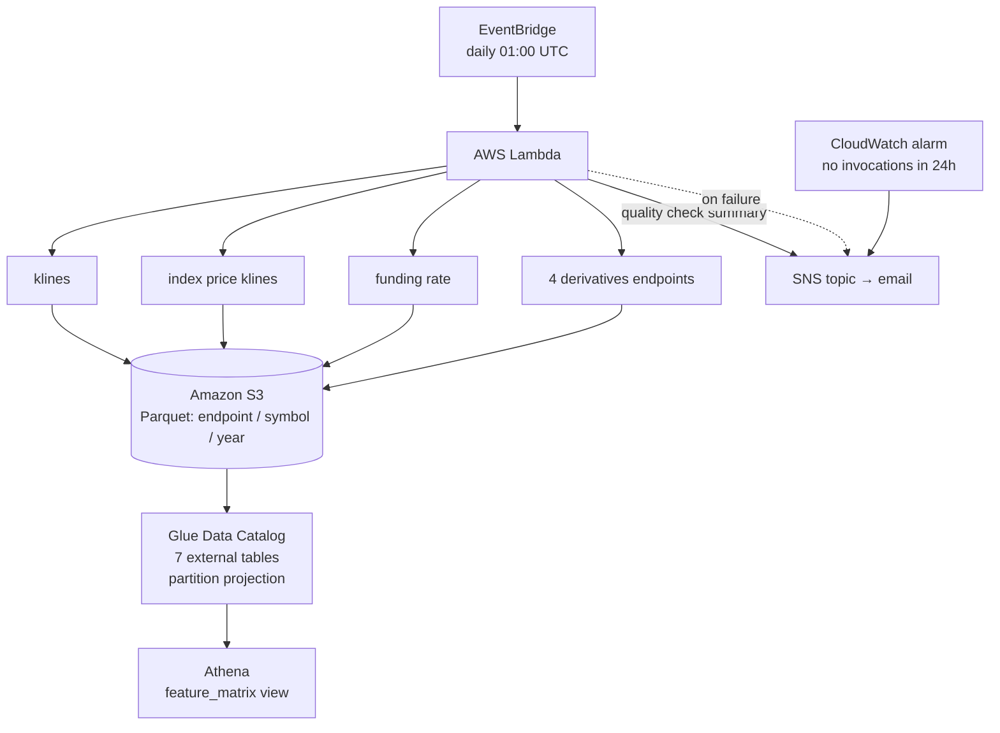

# 📊 Binance Futures Data Pipeline

An end-to-end data pipeline that collects **klines, funding rate, and derivatives** data from the Binance USDⓈ-M Futures API, stores it as Hive-partitioned Parquet in S3, and exposes it through an Athena serving layer — culminating in a single **feature matrix** designed for time-series analysis and ML model development.

All infrastructure is defined in **Terraform**, and every run is checked for data gaps and staleness, with alerts delivered through SNS.

---

## Overview

An AWS Lambda function runs once a day on an EventBridge schedule and collects **7 datasets per symbol** from the Binance Futures API. Raw data lands in S3 as Parquet, partitioned by endpoint, symbol, and year, and is queried through Glue/Athena external tables that feed a single hourly feature matrix view.

The pipeline has four layers:

1. **Ingestion** — EventBridge-triggered Lambda pulls from the Binance API.
2. **Storage** — Hive-partitioned Parquet in S3 (`endpoint=` / `symbol=` / `year=`), loaded incrementally via watermarks.
3. **Serving** — Glue Data Catalog external tables (partition projection) and a One Big Table feature-matrix view in Athena.
4. **Monitoring** — in-Lambda data quality checks, a failure destination, and a "didn't run" alarm, all routed to SNS.

Incremental loading is driven by a **per-symbol, per-endpoint watermark** stored as a small JSON file in S3. On the first run, each endpoint backfills its full available history; on every subsequent run, fetching resumes from the last recorded `startTime`, and new rows are upserted — deduplicating by the endpoint's time field so no rows are ever duplicated.

**Collected datasets per symbol:**

| Dataset | Binance Endpoint | Time Field | First-Run Backfill |
| :---- | :---- | :---- | :---- |
| Klines (OHLCV) | `/fapi/v1/klines` | `open_time` | From 2019-09-05 (futures launch) |
| Index Price Klines | `/fapi/v1/indexPriceKlines` | `open_time` | From 2019-09-05 (futures launch) |
| Funding Rate | `/fapi/v1/fundingRate` | `fundingTime` | From 2019-09-05 (futures launch) |
| Open Interest | `/futures/data/openInterestHist` | `timestamp` | Last ~30 days (API limit) |
| Global Long/Short Account Ratio | `/futures/data/globalLongShortAccountRatio` | `timestamp` | Last ~30 days (API limit) |
| Top Trader Account Ratio | `/futures/data/topLongShortAccountRatio` | `timestamp` | Last ~30 days (API limit) |
| Top Trader Position Ratio | `/futures/data/topLongShortPositionRatio` | `timestamp` | Last ~30 days (API limit) |

**Note on backfill limits:** Binance's `/futures/data/*` endpoints only expose the most recent ~30 days of history, so derivatives first-runs backfill the full ~30-day window available. Klines, index price klines, and funding rate have no such limit and are paginated all the way back to the futures launch (or the symbol's listing date, if later).

**Note on derived features:** the taker buy/sell ratio and the basis are *not* collected from their dedicated endpoints — both are derived at query time from data already collected (klines `taker_buy_base` / `volume`, and klines vs. index price klines), avoiding redundant datasets.

---

## Architecture


```mermaid
flowchart TD
    EB["EventBridge<br/>daily 01:00 UTC"] --> L[AWS Lambda]

    L --> K[klines]
    L --> IP[index price klines]
    L --> F[funding rate]
    L --> D[4 derivatives endpoints]

    K --> S3[("Amazon S3<br/>Parquet: endpoint / symbol / year")]
    IP --> S3
    F --> S3
    D --> S3

    S3 --> G["Glue Data Catalog<br/>7 external tables<br/>partition projection"]
    G --> V["Athena<br/>feature_matrix view"]

    L -- quality check summary --> SNS[SNS topic → email]
    L -. on failure .-> SNS
    CW["CloudWatch alarm<br/>no invocations in 24h"] --> SNS
```

**Per endpoint, per symbol, each run:**

1. Read the watermark JSON (`last_startTime`). Missing file → treated as first run.
2. **First run:** klines / index price / funding rate paginate from 2019-09-05; derivatives fetch the last ~30 days.
3. **Incremental run:** fetch from `last_startTime + 1`.
4. Clean (deduplicate on time field, coerce to numeric, write with `index=False`).
5. Upsert into the endpoint's yearly Parquet file(s) (concat → drop duplicates → sort).
6. Write the new watermark.
7. Run gap and freshness checks on the new data (see [Monitoring](#monitoring--data-quality)).

After all symbols are processed, the run publishes **one SNS summary** of the quality check results.

**Long backfills:** if a run gets close to the Lambda timeout, it stops early after saving its watermarks. The next invocation resumes where it left off, so a large first-run backfill can be completed simply by invoking the function repeatedly.

One file is written **per endpoint, per symbol, per year**. The datasets are joined into a single wide table only at the serving layer (see below), not at ingestion.

---

## Environment Variables

These are set on the Lambda by Terraform:

| Variable | Required | Default | Description |
| :---- | :---- | :---- | :---- |
| `S3_BUCKET` | ✅ | — | S3 bucket name where Parquet and watermark files are stored |
| `SYMBOLS` | ✅ | — | Comma-separated list of trading pairs (e.g. `BTCUSDT,ETHUSDT`) |
| `SNS_TOPIC_ARN` | ✅ | — | ARN of the SNS topic that receives the quality check summary |
| `PERIOD` | ❌ | `1h` | Aggregation period for klines & derivatives (`5m`, `15m`, `1h`, `4h`, `1d`) |

Incremental fetching is bounded by the watermark, not a fixed row count. Funding rate ignores `PERIOD` (it has fixed settlement times).

---

## S3 Output

### Layout

```
s3://{S3_BUCKET}/binance-futures/
├── _watermark/
│     └── {SYMBOL}-{endpoint}-period={PERIOD}.json
└── endpoint={endpoint}/
      └── symbol={SYMBOL}/
            └── year={YYYY}/
                  └── {SYMBOL}-{endpoint}-period={PERIOD}.parquet
```

Hive-style partition keys (`endpoint=`, `symbol=`, `year=`) let Athena use **partition projection** to prune down to only the symbols and years a query touches.

**Why yearly partitions?** The whole dataset is small (tens of MB). Monthly partitions would have produced thousands of ~6 KB files — the classic small-files problem, where per-file overhead dominates query time. Yearly partitions keep files a reasonable size while still letting time-bounded queries skip old years.

### Watermark file

Each `_watermark/*.json` tracks incremental state for one symbol + endpoint:

```json
{
  "symbol": "BTCUSDT",
  "period": "1h",
  "endpoint": "openInterestHist",
  "last_startTime": 1718000000000,
  "update_time": 1718003600000,
  "update_time_UTC": "2024-06-10T08:00:00+00:00"
}
```

### Parquet schemas (raw Binance columns)

Each endpoint is stored with the raw columns Binance returns.

**Klines** (`endpoint=klines`) — `ignore` column dropped:

```
open_time · open · high · low · close · volume · close_time · 
quote_volume · num_trades · taker_buy_base · taker_buy_quote
```

**Index price klines** (`endpoint=indexPriceKlines`):

```
open_time · open · high · low · close · close_time
```

**Funding rate** (`endpoint=fundingRate`):

```
symbol · fundingTime · fundingRate · markPrice
```

**Open interest** (`endpoint=openInterestHist`):

```
symbol · sumOpenInterest · sumOpenInterestValue · CMCCirculatingSupply · timestamp
```

**Global / Top-trader ratios** (`globalLongShortAccountRatio`, `topLongShortAccountRatio`, `topLongShortPositionRatio`):

```
symbol · longAccount · shortAccount · longShortRatio · timestamp
```

For `topLongShortPositionRatio`, `longAccount` and `shortAccount` represent position share rather than account share.

All timestamp/time fields are Unix epoch **milliseconds (UTC)**, stored exactly as Binance returns them (tz-naive Parquet for Athena compatibility).

---

## Serving Layer (Athena)

The raw Parquet files are exposed as a queryable serving layer in the `binance_futures` Glue database, culminating in a single feature matrix for model training.

### External Tables

Seven external tables (one per endpoint) sit over the S3 data, each using **partition projection** on two keys — partitions are computed at query time with zero maintenance (no crawlers, no `MSCK REPAIR`, no manual `ADD PARTITION`):

- `symbol` — `enum` projection, values driven by the Terraform `symbols` variable, so adding a symbol is a one-line change plus `terraform apply`.
- `year` — `date` projection with format `yyyy` and range `2019,NOW`, so new years appear automatically.

The tables are managed by Terraform. Equivalent DDL, for reference (funding rate):

```sql
CREATE EXTERNAL TABLE funding_rate (
    fundingtime BIGINT,
    fundingrate DOUBLE,
    markprice   DOUBLE
)
PARTITIONED BY (symbol STRING, year STRING)
STORED AS PARQUET
LOCATION 's3://<your-bucket>/binance-futures/endpoint=fundingRate/'
TBLPROPERTIES (
    'projection.enabled'            = 'true',
    'projection.symbol.type'        = 'enum',
    'projection.symbol.values'      = 'BTCUSDT,ETHUSDT,...',
    'projection.year.type'          = 'date',
    'projection.year.format'        = 'yyyy',
    'projection.year.range'         = '2019,NOW',
    'projection.year.interval'      = '1',
    'projection.year.interval.unit' = 'YEARS'
);
```

### Feature Matrix View (One Big Table)

`athena/feature_matrix_view.sql` defines a denormalized **One Big Table (OBT)** — a single hourly feature matrix per `(symbol, timestamp)` built by joining all endpoints, designed as the training dataset for downstream ML.

Transformations handled in the view:

- **Timestamp alignment** — funding-rate timestamps drift a few milliseconds off the hour, in either direction. Timestamps are stored raw and snapped to the hour on read with `((fundingtime + 3600000 / 5) / 3600000) * 3600000`: adding 12 minutes before the integer-division floor means a timestamp slightly *before* the hour (e.g. `07:59:59.998`) lands on `08:00` rather than falling back to `07:00`, so joins match cleanly. The Lambda quality check applies the same rounding rule, so both agree on what "on the hour" means.
- **Funding-rate forward-fill** — funding settles every 8 h while other metrics are hourly. A `LAST_VALUE(...) IGNORE NULLS OVER (PARTITION BY symbol ORDER BY ts)` window carries the last known funding rate forward across the intervening hours. The frame is backward-looking only (`UNBOUNDED PRECEDING` to `CURRENT ROW`), so there is no look-ahead leakage.
- **Derived features** — `basis_rate` computed as `(close − index_close) / index_close`; taker long/short ratio derived inline from klines as `taker_buy_base / (volume − taker_buy_base)`.
- **Redundancy pruning** — base-vs-quote duplicate columns (`sumOpenInterestValue`, `quote_volume`) and near-static fields (`CMCCirculatingSupply`) are dropped in favour of a single representative per concept.

Because the derivatives endpoints are capped at ~30 days, the joined feature matrix uses INNER joins on those tables and clips to the window where all features coexist, growing continuously as the pipeline runs.

The view is kept as a view rather than materialized — at this data size it queries quickly, and it always reflects the latest data. It is **not** managed by Terraform; create it by running `athena/feature_matrix_view.sql` in Athena after the database exists.

---

## Monitoring & Data Quality

Three independent signals cover the three ways the pipeline can go wrong:

| Failure mode | Detection | Alert |
| :---- | :---- | :---- |
| Data arrives but has holes or is stale | In-Lambda gap + freshness checks | One SNS summary per run |
| Lambda runs but crashes | Lambda `OnFailure` async destination | SNS |
| Lambda never runs (schedule broken/disabled) | CloudWatch alarm: `Invocations < 1` over 24 h, missing data treated as breaching | SNS |

**Why the third alarm?** A failure destination only fires when the function actually runs and fails. If the schedule stops triggering, nothing fails — the pipeline just goes silent — so "no runs" needs its own alarm.

**Quality check details:**

- **Gap check** — looks for missing hourly intervals, starting from the previous watermark so the boundary between runs is checked too.
- **Freshness check** — flags an endpoint whose latest row is older than expected.
- **Funding rate** — only gaps longer than 8 h are flagged, because Binance can change a symbol's settlement interval.

**Tip:** confirm the SNS email subscription with `--authenticate-on-unsubscribe true` so a stray click on an email's unsubscribe link can't silently remove it.

---

## Infrastructure (Terraform)

All AWS resources live in `terraform/`, one file per concern. They were originally created by hand and brought under Terraform with `import` blocks, then renamed for consistency.

| Resource | Name |
| :---- | :---- |
| Lambda function | `binance-futures-collector` |
| IAM role | `binance-futures-collector-role` |
| EventBridge rule | `binance-futures-collector-daily` |
| CloudWatch log group | `/aws/lambda/binance-futures-collector` (30-day retention) |
| CloudWatch alarm | `binance-futures-collector-not-running` |
| SNS topic | `lambda-error-notification` |
| Glue database | `binance_futures` (+ 7 external tables) |

**Setup:**

```bash
cd terraform
cp terraform.tfvars.example terraform.tfvars   # fill in bucket name, notification email, symbols
terraform init
terraform plan
terraform apply
```

`terraform.tfvars` is gitignored so the bucket name and email address stay out of the repo.

---

## IAM Permissions

The Lambda execution role (managed by Terraform) has:

- `AWSLambdaBasicExecutionRole` — writing CloudWatch logs.
- An inline S3 policy — read/write on the data prefix and list on the bucket.
- An SNS publish policy — for the quality summary and the failure destination.

```json
[
  {
    "Effect": "Allow",
    "Action": ["s3:GetObject", "s3:PutObject"],
    "Resource": "arn:aws:s3:::your-bucket-name/binance-futures/*"
  },
  {
    "Effect": "Allow",
    "Action": "s3:ListBucket",
    "Resource": "arn:aws:s3:::your-bucket-name"
  },
  {
    "Effect": "Allow",
    "Action": "sns:Publish",
    "Resource": "arn:aws:sns:<region>:<account-id>:lambda-error-notification"
  }
]
```

---

## Dependencies

```
requests
pandas
pyarrow
boto3
```

No dependencies are bundled in the deployment package — they come from Lambda layers:

| Package | Source |
| :---- | :---- |
| `requests` | Klayers layer (`Klayers-p314-requests`) |
| `pandas`, `pyarrow` | AWS-managed layer (`AWSSDKPandas-Python314`) |
| `boto3` | Pre-installed in the Lambda runtime |

Because the layers carry the heavy libraries, the function package itself is only a few KB, so a container image isn't needed.

---

## Deployment

### Lambda Settings

| Setting | Value |
| :---- | :---- |
| Runtime | Python 3.14 |
| Handler | `lambda_function.lambda_handler` |
| Memory | 512 MB |
| Timeout | 600 s |
| Architecture | any |

### Schedule

| Setting | Value | Reason |
| :---- | :---- | :---- |
| Schedule | `cron(0 1 * * ? *)` — daily 01:00 UTC | ~24 new hourly rows/day; watermark guarantees no gaps regardless of cadence |
| `PERIOD` | `1h` | 1-hour candles / derivatives aggregation |
| Derivatives history | ~30 days | Binance only exposes recent derivatives data |

Because incremental fetching is watermark-driven, the pipeline self-heals after missed runs for klines, index price klines, and funding rate — it simply fetches everything since the last success. **Derivatives are the exception:** Binance only serves ~30 days of history, so any outage longer than that leaves a permanent gap. The CloudWatch "not running" alarm exists to catch that long before it happens.

### Adding symbols

1. Add the symbol to `symbols` in `terraform.tfvars` and run `terraform apply` (updates both the Lambda's `SYMBOLS` and the tables' partition projection).
2. Invoke the Lambda — repeatedly if needed — until the backfill finishes; the stopped-early guard resumes each time.
3. Recreate or re-run the `feature_matrix` view if its SQL filters on specific symbols.

Note that a newly added symbol only gets derivatives history from ~30 days before it was added — earlier data is no longer available from Binance.

---

## Error Handling

- **Per-symbol isolation:** if one symbol fails (API error, bad data), the others continue processing. The exception is caught in `lambda_handler` and captured in the return summary.
- **Missing watermark (first run):** `read_watermark` catches `NoSuchKey` → returns `None` → triggers a full backfill for that endpoint.
- **API non-200 response:** the fetch function returns `None`; `fetch_process` logs it and returns `"FAILED — fetch error"` without crashing the run.
- **No new data:** returns `"OK — no new data"` when the incremental fetch is empty.
- **Unhandled failure:** routed to SNS through the Lambda `OnFailure` destination.
- **Return body** always includes a per-symbol, per-endpoint summary:

```json
{
  "summary": {
    "BTCUSDT": {
      "open_interest": {"new_rows": 24, "total_rows": 720,   "last_startTime": 1718000000000},
      "fundingrate":   {"new_rows": 3,  "total_rows": 12960, "last_startTime": 1718000000000},
      "klines":        {"new_rows": 24, "total_rows": 42000, "last_startTime": 1718000000000}
    }
  }
}
```

---

## Project Structure

```
binance-futures-data-collector/
├── src/
│   └── binance-futures-data-collector.py   # collector, quality checks, Lambda entry point (lambda_handler)
├── athena/
│   ├── tables/                             # reference DDL per endpoint (live tables managed by Terraform)
│   │   ├── klines.sql
│   │   ├── index_price_klines.sql
│   │   ├── funding_rate.sql
│   │   ├── open_interest.sql
│   │   ├── global_ls_account_ratio.sql
│   │   ├── top_ls_account_ratio.sql
│   │   └── top_ls_position_ratio.sql
│   └── feature_matrix_view.sql             # One Big Table: joined hourly feature matrix
├── terraform/
│   ├── version.tf · providers.tf · variables.tf · data.tf
│   ├── lambda.tf · iam.tf · events.tf · logs.tf · sns.tf
│   ├── athena.tf                           # Glue database + tables
│   └── terraform.tfvars.example
├── README.md
├── requirements.txt
└── LICENSE
```

---

## Notes

- All timestamps are stored in **UTC** (Unix epoch milliseconds), unmodified; hour alignment happens on read.
- Each endpoint lands in its **own files**. The datasets are joined into a wide feature matrix by the Athena `feature_matrix` view at query time, not when the data is collected.
- The upsert logic uses `keep="last"` deduplication, so re-running the function for an overlapping window is safe and idempotent.
- Binance rate limits apply. Fetch loops `time.sleep(0.3)` between paginated pages to stay well clear of them (exceeding them can trigger a temporary IP ban, HTTP 418).
- `PERIOD` affects klines and derivatives only; funding rate settles on Binance's fixed schedule.
