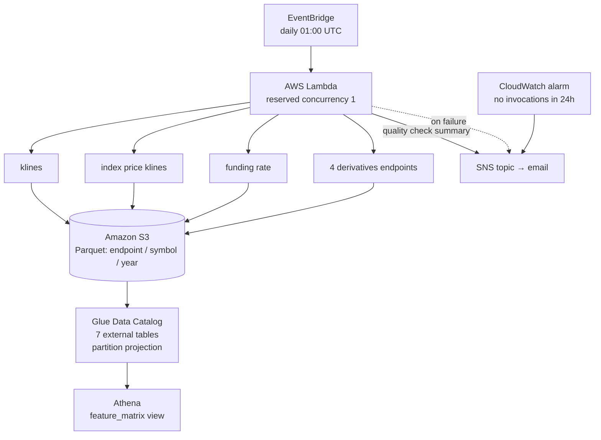

# 📊 Binance Futures Data Pipeline

An end-to-end data pipeline that collects **klines, funding rate, and derivatives** data from the Binance USDⓈ-M Futures API, stores it as Hive-partitioned Parquet in S3, and exposes it through an Athena serving layer — culminating in a single **feature matrix** designed for time-series analysis and ML model development.

All infrastructure is defined in **Terraform**, every dataset is validated against an explicit schema before it is written, and every run is checked for data gaps and staleness, with alerts delivered through SNS.

---

## Overview

An AWS Lambda function runs once a day on an EventBridge schedule and collects **7 datasets per symbol** from the Binance Futures API. Raw data lands in S3 as Parquet, partitioned by endpoint, symbol, and year, and is queried through Glue/Athena external tables that feed a single hourly feature matrix view.

The pipeline has four layers:

1. **Ingestion** — EventBridge-triggered Lambda pulls from the Binance API, with automatic retries for transient errors.
2. **Storage** — Hive-partitioned Parquet in S3 (`endpoint=` / `symbol=` / `year=`), loaded incrementally via watermarks and enforced against a per-endpoint schema.
3. **Serving** — Glue Data Catalog external tables (partition projection) and a One Big Table feature-matrix view in Athena.
4. **Monitoring** — in-Lambda data quality checks, a failure destination, and a "didn't run" alarm, all routed to SNS.

Incremental loading is driven by a **per-symbol, per-endpoint watermark** stored as a small JSON file in S3. On the first run, each endpoint backfills its full available history; on every subsequent run, fetching resumes from the last recorded `startTime`, and new rows are upserted — deduplicating by the endpoint's time field so no rows are ever duplicated.

**Collected datasets per symbol:**

| Dataset | Binance Endpoint | Time Field | First-Run Backfill |
| :---- | :---- | :---- | :---- |
| Klines (OHLCV) | `/fapi/v1/klines` | `open_time` | From 2019-09-05 (futures launch) |
| Index Price Klines | `/fapi/v1/indexPriceKlines` | `open_time` | From 2019-09-05 (futures launch) |
| Funding Rate | `/fapi/v1/fundingRate` | `fundingTime` | From 2019-09-05 (futures launch) |
| Open Interest | `/futures/data/openInterestHist` | `timestamp` | Last ~30 days (API limit)\* |
| Global Long/Short Account Ratio | `/futures/data/globalLongShortAccountRatio` | `timestamp` | Last ~30 days (API limit)\* |
| Top Trader Account Ratio | `/futures/data/topLongShortAccountRatio` | `timestamp` | Last ~30 days (API limit)\* |
| Top Trader Position Ratio | `/futures/data/topLongShortPositionRatio` | `timestamp` | Last ~30 days (API limit)\* |

\* Older derivatives history can be filled once from the Binance public data archive with [`scripts/backfill_derivatives.py`](#scripts).

**Note on backfill limits:** Binance's `/futures/data/*` endpoints only expose the most recent ~30 days of history and reject older times with HTTP 400 (`-1130`), so derivatives first-runs backfill the ~30-day window available. Klines, index price klines, and funding rate have no such limit and are paginated all the way back to the futures launch (or the symbol's listing date, if later).

**Note on derived features:** the taker buy/sell ratio and the basis are *not* collected from their dedicated endpoints — both are derived at query time from data already collected (klines `taker_buy_base` / `volume`, and klines vs. index price klines), avoiding redundant datasets.

---

## Architecture


```mermaid
flowchart TD
    EB["EventBridge<br/>daily 01:00 UTC"] --> L["AWS Lambda<br/>reserved concurrency 1"]

    L --> K[klines]
    L --> IP[index price klines]
    L --> F[funding rate]
    L --> D[4 derivatives endpoints]

    K --> S3[("Amazon S3<br/>Parquet: endpoint / symbol / year")]
    IP --> S3
    F --> S3
    D --> S3

    S3 --> G["Glue Data Catalog<br/>7 external tables<br/>partition projection"]
    G --> V["Athena<br/>feature_matrix view"]

    L -- quality check summary --> SNS[SNS topic → email]
    L -. on failure .-> SNS
    CW["CloudWatch alarm<br/>no invocations in 24h"] --> SNS
```

**Per endpoint, per symbol, each run:**

1. Read the watermark JSON (`last_startTime`). Missing file → treated as first run.
2. **First run:** klines / index price / funding rate paginate from 2019-09-05; derivatives fetch the last ~30 days.
3. **Incremental run:** fetch from `last_startTime + 1`. For derivatives, a watermark older than Binance's ~30-day retention is clamped forward to the oldest available time (the lost range is reported as a gap in step 6).
4. Report any columns Binance returned that are not in the endpoint's schema.
5. **Enforce the schema** (`clean_df`): cast every column to its declared type, turn empty strings into null for nullable columns, fail on missing columns, unparseable values, or nulls in non-nullable columns, keep only the schema's columns, and deduplicate on the time field.
6. Run gap and freshness checks (see [Monitoring](#monitoring--data-quality)).
7. Upsert into the endpoint's yearly Parquet file(s) (read → concat → drop duplicates → sort → write).
8. Write the new watermark.

After all symbols are processed, the run publishes **one SNS summary** of all errors and quality issues (only when there is something to report).

**Long backfills:** if a run gets close to the Lambda timeout, it stops early after saving its watermarks. The next invocation resumes where it left off, so a large first-run backfill can be completed simply by invoking the function repeatedly.

One file is written **per endpoint, per symbol, per year**. The datasets are joined into a single wide table only at the serving layer (see below), not at ingestion.

### Pagination

| Endpoints | Paging | Stops when |
| :---- | :---- | :---- |
| Klines, index price klines, funding rate | by `startTime`; next page starts after the last row received | a page returns fewer rows than the limit |
| Derivatives (`/futures/data/*`) | fixed time windows using `endTime` only; next window starts at the previous `endTime + 1` | the window reaches the current time |

The derivatives endpoints ignore `startTime` on its own (they return the newest rows) and answer "latest N rows ≤ `endTime`", so they are paged by time window rather than by the rows returned. Advancing by window, not by the last row, guarantees the loop always moves forward, even on empty or short pages. The last window's row limit is rounded **up** so its oldest row is never cut off.

---

## Environment Variables

These are set on the Lambda by Terraform:

| Variable | Required | Default | Description |
| :---- | :---- | :---- | :---- |
| `S3_BUCKET` | ✅ | — | S3 bucket name where Parquet and watermark files are stored |
| `SYMBOLS` | ✅ | — | Comma-separated list of trading pairs (e.g. `BTCUSDT,ETHUSDT`) |
| `SNS_TOPIC_ARN` | ✅ | — | ARN of the SNS topic that receives the quality check summary |
| `S3_PREFIX` | ❌ | `binance-futures` | Key prefix for all data and watermark files |
| `PERIOD` | ❌ | `1h` | Aggregation period for klines & derivatives (`5m`, `15m`, `30m`, `1h`, `2h`, `4h`, `6h`, `12h`, `1d`) |

Incremental fetching is bounded by the watermark, not a fixed row count. Funding rate ignores `PERIOD` (it has fixed settlement times).

---

## S3 Output

### Layout

```
s3://{S3_BUCKET}/{S3_PREFIX}/
├── _watermark/
│     └── {SYMBOL}-{endpoint}-period={PERIOD}.json
└── endpoint={endpoint}/
      └── symbol={SYMBOL}/
            └── year={YYYY}/
                  └── data.parquet
```

Hive-style partition keys (`endpoint=`, `symbol=`, `year=`) let Athena use **partition projection** to prune down to only the symbols and years a query touches.

**Why yearly partitions?** The whole dataset is small (tens of MB). Monthly partitions would have produced thousands of ~6 KB files — the classic small-files problem, where per-file overhead dominates query time. Yearly partitions keep files a reasonable size while still letting time-bounded queries skip old years.

### Watermark file

Each `_watermark/*.json` tracks incremental state for one symbol + endpoint:

```json
{
  "symbol": "BTCUSDT",
  "period": "1h",
  "endpoint": "openInterestHist",
  "last_startTime": 1718000000000,
  "update_time": 1718003600000,
  "update_time_UTC": "2024-06-10T08:00:00+00:00"
}
```

Funding rate has no period, so its watermark is `{SYMBOL}-fundingRate-period=None.json`.

### Parquet schemas

Every endpoint's columns, types, and nullability are declared in [`src/endpoints.py`](src/endpoints.py) and enforced before anything is written, so each file always has exactly these columns, in this order:

| Endpoint | Columns |
| :---- | :---- |
| `klines` | `open_time` · `open` · `high` · `low` · `close` · `volume` · `close_time` · `quote_volume` · `num_trades` · `taker_buy_base` · `taker_buy_quote` |
| `indexPriceKlines` | `open_time` · `open` · `high` · `low` · `close` · `close_time` |
| `fundingRate` | `symbol` · `fundingTime` · `fundingRate` · `markPrice`† · `rateType`† |
| `openInterestHist` | `symbol` · `sumOpenInterest` · `sumOpenInterestValue` · `CMCCirculatingSupply`† · `timestamp` |
| `globalLongShortAccountRatio`, `topLongShortAccountRatio`, `topLongShortPositionRatio` | `symbol` · `longAccount` · `longShortRatio` · `shortAccount` · `timestamp` |

† nullable. `markPrice` is empty for old funding records (e.g. 2019), and `rateType` was added by Binance in 2026.

- Time fields are `int64`, prices/ratios `float64`, `symbol` and `rateType` strings.
- For `topLongShortPositionRatio`, `longAccount` and `shortAccount` represent position share rather than account share.
- Derivatives rows filled from the archive (see [Scripts](#scripts)) only carry `symbol`, `timestamp`, and the ratio / open interest columns; the remaining columns are null for those rows, and some archive ratios are empty.
- All timestamp/time fields are Unix epoch **milliseconds (UTC)**, stored exactly as Binance returns them (tz-naive Parquet for Athena compatibility).

---

## Serving Layer (Athena)

The raw Parquet files are exposed as a queryable serving layer in the `binance_futures` Glue database, culminating in a single feature matrix for model training.

### External Tables

Seven external tables (one per endpoint) sit over the S3 data, each using **partition projection** on two keys — partitions are computed at query time with zero maintenance (no crawlers, no `MSCK REPAIR`, no manual `ADD PARTITION`):

- `symbol` — `enum` projection, values driven by the Terraform `symbols` variable, so adding a symbol is a one-line change plus `terraform apply`.
- `year` — `int` column with `date` projection, format `yyyy`, range `2019,NOW`, so new years appear automatically. Filter it as a number: `WHERE year = 2025` (no quotes).

Partition pruning has been verified: for BTCUSDT klines, `WHERE year = 2025` scans 14% of the data, exactly that year's share of the rows.

The tables are defined only in [`terraform/athena.tf`](terraform/athena.tf). To see the SQL of a deployed table, run in Athena:

```sql
SHOW CREATE TABLE binance_futures.funding_rate;
```

Equivalent DDL, for reference (funding rate):

```sql
CREATE EXTERNAL TABLE funding_rate (
    fundingtime BIGINT,
    fundingrate DOUBLE,
    markprice   DOUBLE,
    ratetype    STRING
)
PARTITIONED BY (symbol STRING, year INT)
STORED AS PARQUET
LOCATION 's3://<your-bucket>/binance-futures/endpoint=fundingRate'
TBLPROPERTIES (
    'projection.enabled'       = 'true',
    'projection.symbol.type'   = 'enum',
    'projection.symbol.values' = 'BTCUSDT,ETHUSDT,...',
    'projection.year.type'     = 'date',
    'projection.year.format'   = 'yyyy',
    'projection.year.range'    = '2019,NOW'
);
```

### Feature Matrix View (One Big Table)

`athena/feature_matrix_view.sql` defines a denormalized **One Big Table (OBT)** — a single hourly feature matrix per `(symbol, timestamp)` built by joining all endpoints, designed as the training dataset for downstream ML.

Transformations handled in the view:

- **Timestamp alignment** — funding-rate timestamps drift a few milliseconds off the hour, in either direction. Timestamps are stored raw and snapped to the hour on read with `((fundingtime + 3600000 / 5) / 3600000) * 3600000`: adding 12 minutes before the integer-division floor means a timestamp slightly *before* the hour (e.g. `07:59:59.998`) lands on `08:00` rather than falling back to `07:00`, so joins match cleanly. The Lambda quality check applies the same rounding rule, so both agree on what "on the hour" means.
- **Funding-rate forward-fill** — funding settles every 8 h while other metrics are hourly. A `LAST_VALUE(...) IGNORE NULLS OVER (PARTITION BY symbol ORDER BY ts)` window carries the last known funding rate forward across the intervening hours. The frame is backward-looking only (`UNBOUNDED PRECEDING` to `CURRENT ROW`), so there is no look-ahead leakage.
- **Derived features** — `basis_rate` computed as `(close − index_close) / index_close`; taker long/short ratio derived inline from klines as `taker_buy_base / (volume − taker_buy_base)`.
- **Redundancy pruning** — base-vs-quote duplicate columns (`sumOpenInterestValue`, `quote_volume`) and near-static fields (`CMCCirculatingSupply`) are dropped in favour of a single representative per concept.

The view INNER-joins the derivatives tables, so it covers the window where all features coexist: the archive backfill start (or ~30 days before a symbol was added, without the backfill) up to now. Archive-backfilled hours can have null long/short ratios, so handle nulls in those columns when building features.

The view does not expose `year`, so queries on it read every year; at this data size that is fine.

The view is kept as a view rather than materialized — at this data size it queries quickly, and it always reflects the latest data. It is **not** managed by Terraform; create it by running `athena/feature_matrix_view.sql` in Athena after the database exists.

---

## Monitoring & Data Quality

Three independent signals cover the three ways the pipeline can go wrong:

| Failure mode | Detection | Alert |
| :---- | :---- | :---- |
| Data arrives but has holes, is stale, or doesn't match the schema | In-Lambda schema enforcement + gap / freshness checks | One SNS summary per run |
| Lambda runs but crashes | Lambda `OnFailure` async destination | SNS |
| Lambda never runs (schedule broken/disabled) | CloudWatch alarm: `Invocations < 1` over 24 h, missing data treated as breaching | SNS |

**Why the third alarm?** A failure destination only fires when the function actually runs and fails. If the schedule stops triggering, nothing fails — the pipeline just goes silent — so "no runs" needs its own alarm.

**Quality check details:**

- **Gap check** — looks for missing intervals, starting from the previous watermark so the boundary between runs is checked too.
- **Freshness check** — flags an endpoint whose latest row is older than expected; on a day with no new data, the previous watermark is checked instead.
- **Funding rate** — only gaps longer than 8 h are flagged, because Binance can change a symbol's settlement interval.
- **Extra columns** — columns Binance adds that are not in the schema are reported and dropped, so new API fields never change the stored files.
- **Schema violations** — a missing column, an unparseable value, or a null in a non-nullable column fails that endpoint for the run (reported as an error); its watermark does not move, so it is retried on the next run.

**Tip:** confirm the SNS email subscription with `--authenticate-on-unsubscribe true` so a stray click on an email's unsubscribe link can't silently remove it.

---

## Infrastructure (Terraform)

All AWS resources live in `terraform/`, one file per concern. They were originally created by hand and brought under Terraform with `import` blocks, then renamed for consistency.

| Resource | Name |
| :---- | :---- |
| Lambda function | `binance-futures-collector` |
| IAM role | `binance-futures-collector-role` |
| EventBridge rule | `binance-futures-collector-daily` |
| CloudWatch log group | `/aws/lambda/binance-futures-collector` (30-day retention) |
| CloudWatch alarm | `binance-futures-collector-not-running` |
| SNS topic | `lambda-error-notification` |
| Glue database | `binance_futures` (+ 7 external tables) |

**Setup:**

```bash
cd terraform
cp terraform.tfvars.example terraform.tfvars   # fill in bucket name, notification email, symbols
terraform init
terraform plan
terraform apply
```

`terraform.tfvars` is gitignored so the bucket name and email address stay out of the repo.

The deployment zip is built by Terraform from `src/lambda_function.py`, `src/endpoints.py`, and `src/utils.py` (`terraform/data.tf`). A new file in `src/` must be added there too, or the Lambda fails on import.

---

## IAM Permissions

The Lambda execution role (managed by Terraform) has:

- `AWSLambdaBasicExecutionRole` — writing CloudWatch logs.
- An inline S3 policy — read/write on the data prefix and list on the bucket.
- An SNS publish policy — for the quality summary and the failure destination.

```json
[
  {
    "Effect": "Allow",
    "Action": ["s3:GetObject", "s3:PutObject"],
    "Resource": "arn:aws:s3:::your-bucket-name/binance-futures/*"
  },
  {
    "Effect": "Allow",
    "Action": "s3:ListBucket",
    "Resource": "arn:aws:s3:::your-bucket-name"
  },
  {
    "Effect": "Allow",
    "Action": "sns:Publish",
    "Resource": "arn:aws:sns:<region>:<account-id>:lambda-error-notification"
  }
]
```

`s3:ListBucket` matters: without it, S3 returns `AccessDenied` instead of `NoSuchKey` for a missing watermark, and first-run detection would fail.

---

## Dependencies

Minimum versions ([`requirements.txt`](requirements.txt)):

| Package | Minimum | Why |
| :---- | :---- | :---- |
| `requests` | 2.31 | CVE-2023-32681 fix (proxy credentials leak on redirect) |
| `urllib3` | 1.26 | `Retry(allowed_methods=...)`, used for the Binance HTTP retries |
| `pandas` | 2.1 | `Series.replace("", None)` sets null (older pandas forward-fills instead); oldest version tested |
| `pyarrow` | 10.0.1 | Parquet engine; oldest version pandas 2.2 supports |
| `boto3` | 1.26 | no feature-specific floor; conservative baseline |

No dependencies are bundled in the deployment package — they come from Lambda layers:

| Package | Source |
| :---- | :---- |
| `requests`, `urllib3` | Klayers layer (`Klayers-p314-requests`) |
| `pandas`, `pyarrow` | AWS-managed layer (`AWSSDKPandas-Python314`) |
| `boto3` | Pre-installed in the Lambda runtime |

Because the layers carry the heavy libraries, the function package itself is only a few KB, so a container image isn't needed.

---

## Deployment

### Lambda Settings

| Setting | Value |
| :---- | :---- |
| Runtime | Python 3.14 |
| Handler | `lambda_function.lambda_handler` |
| Memory | 512 MB |
| Timeout | 600 s |
| Architecture | x86_64 |
| Reserved concurrency | 1 |
| Async retry attempts | 2 (then `OnFailure` → SNS) |

**Why reserved concurrency 1?** Each upsert reads a Parquet file, merges new rows, and writes it back. Two overlapping runs (for example a manual invoke during the scheduled one) could both read the same file, and the later write would drop the other run's rows. With concurrency 1, an extra async invoke waits its turn (Lambda queues and retries it), and an extra sync invoke is throttled.

### Schedule

| Setting | Value | Reason |
| :---- | :---- | :---- |
| Schedule | `cron(0 1 * * ? *)` — daily 01:00 UTC | ~24 new hourly rows/day; watermark guarantees no gaps regardless of cadence |
| `PERIOD` | `1h` | 1-hour candles / derivatives aggregation |
| Derivatives history | ~30 days | Binance only exposes recent derivatives data |

Because incremental fetching is watermark-driven, the pipeline self-heals after missed runs for klines, index price klines, and funding rate — it simply fetches everything since the last success. **Derivatives are the exception:** Binance only serves ~30 days of history, so any outage longer than that leaves a permanent gap. After such an outage the collector clamps its start to the oldest available time, resumes on its own, and reports the lost range as a gap. The CloudWatch "not running" alarm exists to catch an outage long before that happens.

### Adding symbols

1. Add the symbol to `symbols` in `terraform.tfvars` and run `terraform apply` (updates both the Lambda's `SYMBOLS` and the tables' partition projection).
2. Invoke the Lambda — repeatedly if needed — until the backfill finishes; the stopped-early guard resumes each time.
3. Optionally run `scripts/backfill_derivatives.py` to fill older derivatives history from the archive.
4. Recreate or re-run the `feature_matrix` view if its SQL filters on specific symbols.

Note that without the archive backfill, a newly added symbol only gets derivatives history from ~30 days before it was added.

---

## Scripts

One-off tools run locally (not part of the Lambda). They read the bucket, prefix, symbols, and period from the deployed Lambda's configuration.

- **`scripts/backfill_derivatives.py`** — fills derivatives history older than what the API serves, from the Binance public data archive (`data.binance.vision`, daily `metrics` files). For each symbol it downloads every day from the archive's first file up to the oldest row already in S3, verifies each zip against its `.CHECKSUM` file, keeps only rows on `PERIOD` boundaries, and upserts rows older than the existing data into the yearly files. It does not touch watermarks. The archive only provides open interest and the three long/short ratios, so other columns are null for these rows.
- **`scripts/migrate_partitions.py`** — one-off migration from the original single-file-per-symbol layout to the `year=` partitioned layout (writes to `binance-futures-v2/`). Kept for reference; not needed for a new deployment.

---

## Error Handling

- **Per-endpoint isolation:** each endpoint for each symbol runs inside its own `try` in `fetch_process`. If one fails (API error, schema violation), the rest of the run continues, and the error goes into the SNS summary and the return body.
- **Transient HTTP errors:** all Binance calls go through one shared `requests.Session` with a `urllib3` `Retry` policy — up to 3 retries with exponential backoff on 429, 500, 502, 503, 504, timeouts, and connection errors. For 429 the `Retry-After` header is respected.
- **Permanent HTTP errors:** 400 (bad request) and 418 (IP ban) are not retried; retrying a 418 would extend Binance's ban. The error message includes the status code and the start of the response body, so HTML error pages are reported as such.
- **Missing watermark (first run):** `read_watermark` catches `NoSuchKey` → returns `None` → triggers a full backfill for that endpoint.
- **No new data:** the endpoint returns `{"status": "no_new_data"}`; the freshness check still runs against the previous watermark.
- **Stopped early:** with less than 30 s left, the run stops before the next endpoint and reports it; the next invocation continues from the watermarks.
- **Unhandled failure:** after 2 async retries, routed to SNS through the Lambda `OnFailure` destination.
- **Return body** always includes a per-symbol, per-endpoint summary, keyed by Binance endpoint name:

```json
{
  "summary": {
    "BTCUSDT": {
      "openInterestHist": {"status": "ok", "new_rows": 24, "total_rows": 720,   "last_startTime": 1718000000000},
      "fundingRate":      {"status": "ok", "new_rows": 3,  "total_rows": 1083,  "last_startTime": 1718000000000},
      "klines":           {"status": "no_new_data"}
    }
  },
  "stopped_early": false
}
```

---

## Project Structure

```
binance-futures-data-collector/
├── src/
│   ├── lambda_function.py     # Lambda entry point: fetchers, schema enforcement, quality checks, watermarks
│   ├── endpoints.py           # endpoint list + per-endpoint schemas (pure data)
│   └── utils.py               # shared helpers: period → ms, Parquet upsert to S3
├── scripts/
│   ├── backfill_derivatives.py  # one-off: older derivatives history from data.binance.vision
│   └── migrate_partitions.py    # one-off: migration to the year= layout
├── athena/
│   └── feature_matrix_view.sql  # One Big Table: joined hourly feature matrix (not in Terraform)
├── terraform/
│   ├── version.tf · providers.tf · variables.tf · data.tf
│   ├── lambda.tf · iam.tf · events.tf · logs.tf · sns.tf
│   ├── athena.tf                # Glue database + 7 tables
│   └── terraform.tfvars.example
├── README.md
├── requirements.txt
└── LICENSE
```

---

## Notes

- All timestamps are stored in **UTC** (Unix epoch milliseconds), unmodified; hour alignment happens on read.
- Each endpoint lands in its **own files**. The datasets are joined into a wide feature matrix by the Athena `feature_matrix` view at query time, not when the data is collected.
- The upsert logic uses `keep="last"` deduplication, so re-running the function for an overlapping window is safe and idempotent.
- Binance rate limits apply. Fetch loops `time.sleep(0.3)` between pages, and 429 responses are retried only after the `Retry-After` delay (ignoring 429s can trigger a temporary IP ban, HTTP 418).
- `PERIOD` affects klines and derivatives only; funding rate settles on Binance's fixed schedule.
